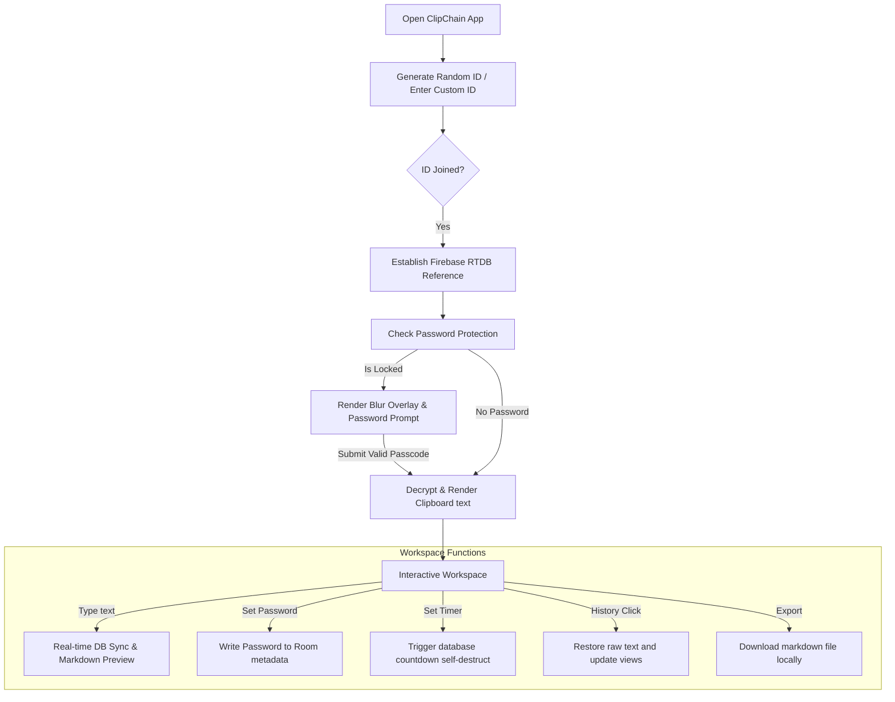

# 📋 ClipChain - Online Clipboard

ClipChain is a modern, real-time clipboard synchronization tool designed to make sharing text between devices seamless and secure. Built with a beautiful glassmorphic UI, it allows you to instantly sync text, links, and code snippets across any device with a web browser.

The application operates as a **lean, anonymous synchronized clipboard**, offering high-performance real-time edits without the friction of user accounts, database ownership controls, or guest submission queues.

---

## ⚡ Application Workflow



### 1. Room Connection
- When you open the application, it automatically assigns a random 8-character ID (hash-route based, e.g., `/#a1b2c3d4`) or allows you to enter a custom ID.
- Any client navigating to the same URL or typing the same ID joins the same synchronization pool.

### 2. Live Synchronization
- Editing text in the main workspace updates the Firebase Realtime Database node instantly.
- Connected clients listen to this text node and merge updates dynamically via a diff-match algorithm, preserving cursor positions and scroll states.

### 3. Passcode Lock Protection
- Lock your clipboard room by setting a passcode. 
- Once set, the content is hidden behind a blur lock screen. Visitors must supply the correct passcode to pull and edit the text.
- Passcode protection can be updated or removed securely by anyone who knows the active password.

### 4. Local History
- Recent clips are tracked and saved strictly in your browser's local storage (`localStorage`). This keeps your personal clips history local to your machine.

---

## ✨ Features

- **⚡ Real-Time Synchronization**: Instantly syncs text across all connected devices using Firebase Realtime Database.
- **🔒 Security First**:
  - **Password Protection**: Lock your clipboard rooms with a password to restrict unauthorized views.
  - **Self-Destruct Timer**: Configure self-destruct expirations (10 minutes, 1 hour, or 24 hours) to wipe the database room automatically.
- **🎨 Stunning UI**:
  - **Glassmorphism Design**: Modern, Translucent aesthetics with HSL-tailored color accents.
  - **Premium Theming**: Beautiful Light (sky-blue) and Dark (midnight-indigo) modes with smooth toggle transitions.
  - **Responsive Layout**: Designed for seamless accessibility across mobile, tablet, and desktop viewports.
- **📝 Live Editor**:
  - **Markdown Support**: Render markdown previews alongside raw input using split-pane or full-pane modes.
  - **Live Search**: Integrated find-in-text query searches with highlighted matches.
  - **Formatting Toolbar**: Dedicated buttons for bold, italic, code-blocks, links, font presets, text colors, and markdown tables.
- **🔗 Easy Connection**:
  - **Custom URLs**: Share custom clipboard routes directly (e.g., `clipchain.com/#my-room`).
  - **QR Code**: Instantly generate scannable QR codes for mobile screen mirroring.
- **📜 Smart History**: Access your last 5 local clip entries and restore them dynamically.

---

## 🛠️ Tech Stack

- **Frontend**: HTML5, Vanilla JavaScript, CSS3
- **Styling**: [Tailwind CSS](https://tailwindcss.com/) (CDN)
- **Backend/Database**: [Firebase Realtime Database](https://firebase.google.com/)
- **Libraries**:
  - [Lucide Icons](https://lucide.dev/) (SVG Icons rendering)
  - [Marked.js](https://marked.js.org/) (Markdown parsing)
  - [QRCode.js](https://github.com/davidshimjs/qrcodejs) (QR Code generation)
  - [EmailJS](https://www.emailjs.com/) (Support request forms)

---

## 🚀 Getting Started

ClipChain is built using static client-side web technologies and requires no complex compilation steps.

### Run Locally

1. **Clone the repository**:
   ```bash
   git clone https://github.com/yourusername/ClipChain.git
   cd ClipChain
   ```

2. **Open the project**:
   - Open `index.html` directly in your web browser.
   - For the best experience (and to avoid CORS restrictions on local asset file URLs), serve it using a local dev server (e.g., Python's `http.server`, Live Server in VS Code, or `npm run dev`).

### Configuration

ClipChain uses Firebase Realtime Database to store room data. The configuration is located at the top of [script.js](file:///Users/ompatel/clipchain/script.js).

To connect your own database instance:
1. Go to the [Firebase Console](https://console.firebase.google.com/).
2. Create a new Firebase project and add a Web App.
3. Turn on the **Realtime Database** service.
4. Replace the credentials inside the `firebaseConfig` object at the top of [script.js](file:///Users/ompatel/clipchain/script.js#L2-L11):

```javascript
const firebaseConfig = {
  apiKey: "YOUR_API_KEY",
  authDomain: "YOUR_PROJECT_ID.firebaseapp.com",
  projectId: "YOUR_PROJECT_ID",
  databaseURL: "https://YOUR_PROJECT_ID-default-rtdb.firebaseio.com"
};
```

---

## 📄 License

This project is open-source and available for personal, educational, and public use under the MIT License.
